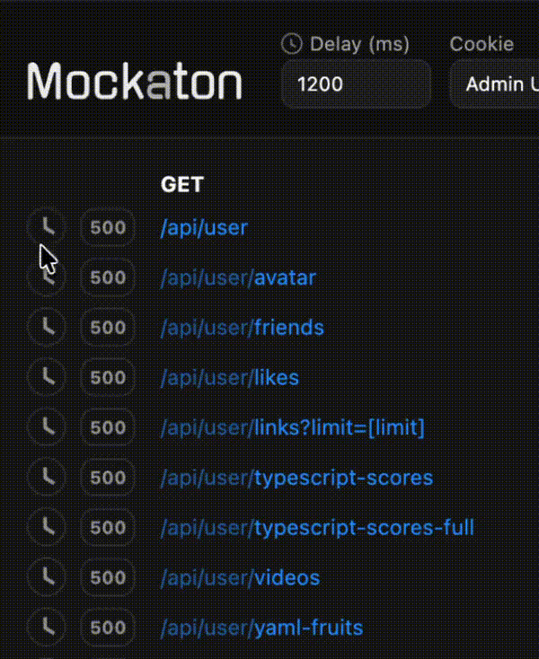

# Changelog
- 10.2.0 reject malicious URLs
- 10.1.0 dashboard: toggle delay with click-drag 
 

 
- 10.0.0 **Breaking Change**: `Mockaton` constructor is now async. 
So if you launch it programmatically, change:
```js
Mockaton()
// to
await Mockaton()
```

---

- 9.6.0 dashboard: persist `groupByMethod` preference in localStorage
- 9.5.0 cli: new `config.logLevel=verbose`
- 9.4.0 dashboard: users can resize panels
 


- 9.3.0 handle head requests for get mocks
- 9.2.0 dashboard: syntax highlight more xml files (such as html)
- 9.1.0 cli: new flag: `--no-open`
- 9.0.0 **Breaking Change**: Commander’s GET APIs have been consolidated into `commander.getState()`. 
  These were undocumented APIs, so you are likely not affected.

---

- 8.27.0 dashboard: group by method checkbox
 

 
- 8.26.0 ui simplify mock-selector label text
- 8.25.0 `--quiet` and `config.logLevel` options
- 8.24.0 show iso date in logs and log static file dispatch
- 8.23.0 cli
- 8.22.0 xml syntax highlight
- 8.21.0 responsive mock list
- 8.20.0 revert progress bar (no clock spinner)
- 8.19.0 move puppeteer and pixaton to devDeps
- 8.18.0 cors. allow `'authorization'` header by default
- 8.17.0 conditionally render proxy toggler
- 8.16.0 watch static mocks dir
- 8.15.0 add `config.delayJitter`
- 8.14.0 static files controls
- 8.13.0 dashboard: dim repeated dirs
 


- 8.12.0 add `config.formatCollectedJSON`
- 8.11.0 allow all the HTTP methods Node.js supports
- 8.10.0 dashboard: global delay field
- 8.9.0 long poll Add or Remove mocks
- 8.8.0 allow proxying individual routes
- 8.7.0 dashboard: highlights and previews 500 mocks when checking the 500 toggler
- 8.6.0 dashboard: save proxied checkbox
- 8.5.0 add demo-app-vite
- 8.4.0 auto register/unregister mocks
- 8.3.0 feat `config.collectProxied`
- 8.2.0 Allow changing proxy fallback server from UI
- 8.1.0 describe http status code in payload viewer title
- 8.0.0 **Breaking change**: `config.plugins` are no longer an Object. Now they are an Array and the
test is now a regex. So if you use custom plugins, change e.g.:
```js
plugins = {
  '.js': jsToJsonPlugin,
  '.ts': jsToJsonPlugin
}
// to
plugins = [
  [/\.(js|ts)$/, jsToJsonPlugin], // Default 
]
```

---

- 7.8.0 support userland plugins
- 7.7.0 TypeScript mocks support
- 7.6.0 render list of static files
- 7.5.0 allowing previewing mock images
- 7.4.0 progress bar for payload viewer
- 7.3.0 Allow CORS Checkbox
- 7.2.0 add content-type as default header when allowing cors
- 7.1.0 CORS support
- 7.0.0 **Breaking change**: Split `PATCH mockaton/edit` into `selectMock` and `setRouteIsDelayed`.
So instead of:
```js
fetch(addr + '/mockaton/edit', {
  method: 'PATCH',
  body: JSON.stringify({
    file: 'api/foo.200.GET.json',
    delayed: true // optional
  })
})

// change it to
await commander.select('api/foo.200.GET.json')
await commander.setMockIsDelayed('api/foo.200.GET.json', true)
```

---

- 6.4.0 Default mock could be selected with the comment `(default)`
- 6.3.0 422 when trying to change a mock that doesn't exist on a route that has mocks
- 6.4.0 no partial comment search
- 6.3.0 Allow extending the mime list
- 6.2.0 Add `config.ignore` regex
- 6.1.0 remove `config.allowedExt`
- 6.0.0 **Breaking change**: Remove feature for using .md files for documentating APIs

---

- 5.0.0 **Breaking change**: .md files no longer use status code in the extension
- 4.0.0 **Breaking change**: rename `config.open` to `config.onReady`
- 3.0.0 **Breaking change**: `config.skipOpen` boolean to `config.open` function

---  

- 2.3.0 style dashboard
- 2.2.0 Allow injecting `extraHeaders`
- 2.1.0 make auto-generate 500's configurable
- 2.0.0 **Breaking change**: Transforms no longer get a mock

--- 

- 1.1.0 Allow writing JSON mocks in JS
