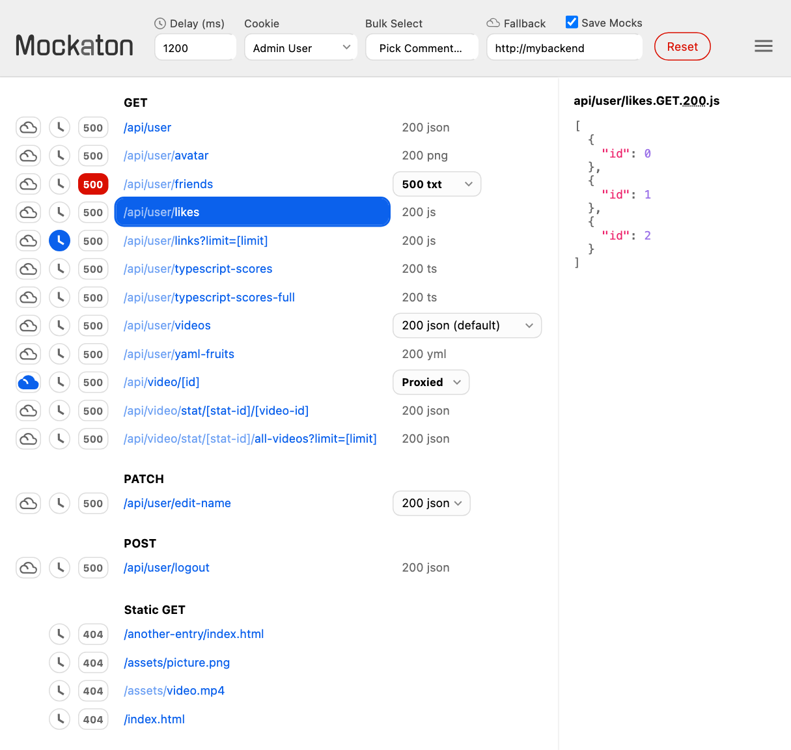
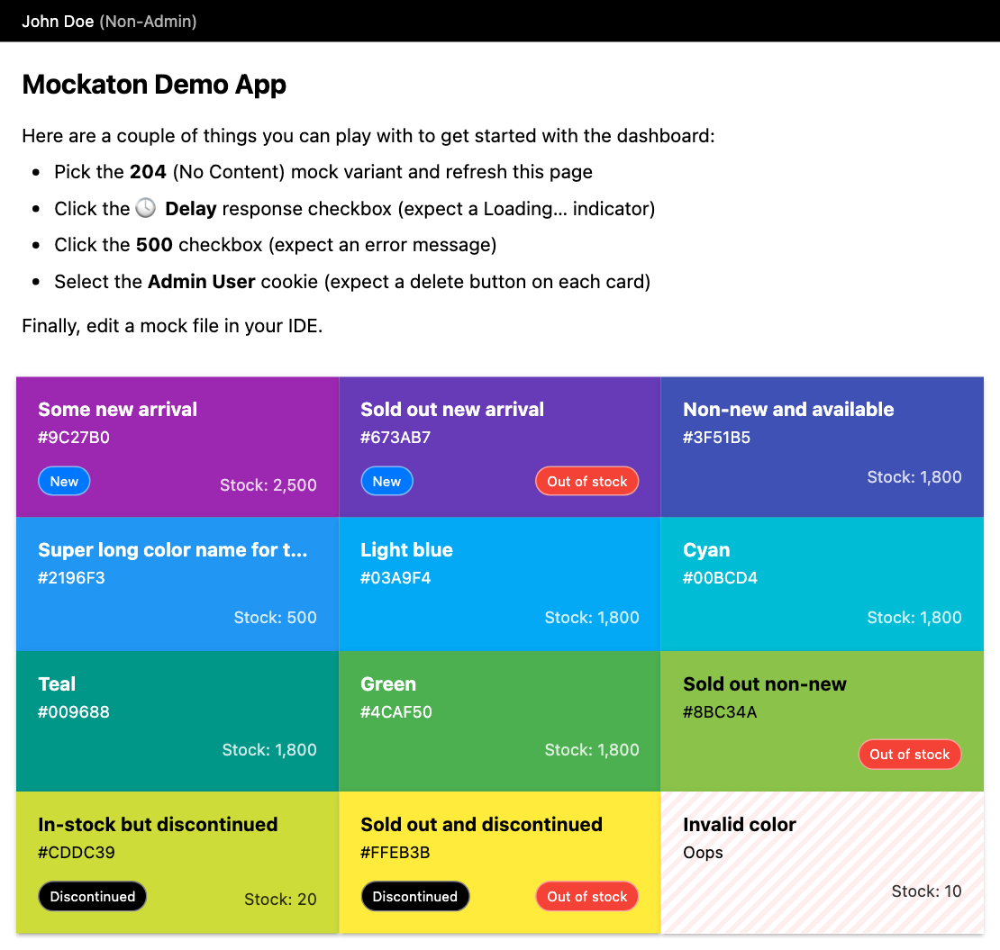

[](https://github.com/ericfortis/mockaton/actions/workflows/test.yml)
[](https://github.com/ericfortis/mockaton/actions/workflows/github-code-scanning/codeql)

An HTTP mock server for simulating APIs with minimal setup
&mdash; ideal for testing difficult to reproduce states.

<br/>

## Motivation

**No API state should be too hard to test.**
With Mockaton, developers can achieve correctness without sacrificing speed.

### Correctness
- Enables testing of complex scenarios that would otherwise be
  skipped. For example, triggering an error on a third-party API. Or if
  you are a frontend developer, triggering it on your project’s backend.
- Allows for deterministic, comprehensive, and consistent state, which helps
  spot inadvertent regressions during development, or for setting up screenshot
  tests, e.g., with [pixaton](https://github.com/ericfortis/pixaton).

### Speed
- Prevents progress from being blocked by waiting for APIs.
- Works around unstable dev backends while developing UIs.
- Time travel. If you commit the mocks to your repo, it’s straightforward
  to check out long-lived branches and bisect bugs, so you don’t
  have to downgrade backends to old API contracts or databases.

<br/>

## Overview
With Mockaton, you don’t need to write code for wiring up your
mocks. Instead, a given directory is scanned for filenames
following a convention similar to the URLs.

For example, for [/api/user/123](#), the filename could be:

<pre>
<code>my-mocks-dir/<b>api/user</b>/[user-id].GET.200.json</code>
</pre>

<br/>

## Dashboard

On the dashboard you can select a mock variant for a particular route, delaying responses,
or triggering an autogenerated `500` error, among other features.


Nonetheless, there’s a programmatic API, which is handy
for setting up tests (see **Commander&nbsp;API** section below).

<picture>
  <source media="(prefers-color-scheme: light)" srcset="pixaton-tests/macos/pic-for-readme.vp810x768.light.gold.png">
  <source media="(prefers-color-scheme: dark)" srcset="pixaton-tests/macos/pic-for-readme.vp810x768.dark.gold.png">
  
</picture>


<br/>
<br/>

## Multiple Mock Variants
Each route can have different mocks. There are two
options for doing that, and they can be combined.

### Adding comments to the filename
Comments are anything within parentheses, including them.

<pre>
api/login<b>(locked out user)</b>.POST.423.json
api/login<b>(invalid login attempt)</b>.POST.401.json
</pre>

### Different response status code
For instance, you can use a `4xx` or `5xx` status code for triggering error
responses, or a `2xx` such as `204` for testing empty collections.

<pre>
api/videos.GET.<b>204</b>.empty # No Content
api/videos.GET.<b>403</b>.json  # Forbidden
api/videos.GET.<b>500</b>.txt   # Internal Server Error
</pre>


<br/>

## Scraping Mocks from your Backend

### Option 1: Browser Extension
With the companion [browser-devtools
extension](https://github.com/ericfortis/download-http-requests-browser-ext)
you can download all the HTTP responses, and they
get saved following Mockaton’s filename convention.

### Option 2: Fallback to Your Backend
<details>
<summary>Details</summary>

This option could be a bit elaborate if your backend uses third-party authentication,
because you’d have to manually inject cookies or `sessionStorage` tokens.

On the other hand, proxying to your backend is straightforward if your backend
handles the session cookie, or if you can develop without auth.

Either way you can forward requests to your backend for routes you don’t have
mocks for, or routes that have the ☁️ **Cloud Checkbox** checked. In addition, by
checking ✅ **Save Mocks**, you can collect the responses that hit your backend.
They will be saved in your `config.mocksDir` following the filename convention.
</details>


<br/>

## Privacy and Security
- Zero dependencies (no runtime and no build packages).
- Does not write to disk. Except when you select ✅ **Save Mocks** for scraping mocks from a backend.
- Does not initiate network connections (no logs, no telemetry).
- Does not hijack your HTTP client.
- Auditable. Organized and small &mdash; under 4 KLoC (50% is UI and tests) with 92% code coverage.


## Basic Usage
Create a sample mock in the default mocks directory (`./mockaton-mocks`).
```sh
mkdir -p mockaton-mocks/api/
echo "[1,2,3]" > mockaton-mocks/api/foo.GET.200.json
```

Mockaton is a Node.js program, so you install and run it with:
```shell
npx mockaton --port 2345
```

Or, if you have a `package.json`
```shell
npm install mockaton --save-dev
```

```json
{
  "scripts": {
    "mockaton": "mockaton --port 2345"
  }
}
```


## CLI Options
The CLI options override their counterparts in `mockaton.config.js`

```txt
-c, --config <file>    (default: ./mockaton.config.js)

-m, --mocks-dir <dir>  (default: ./mockaton-mocks/)
-s, --static-dir <dir> (default: ./mockaton-static-mocks/)

-H, --host <host>      (default: 127.0.0.1)
-p, --port <port>      (default: 0) which means auto-assigned

-q, --quiet            Errors only
-h, --help             Show this help
-v, --version          Show version
```


## mockaton.config.js (Optional)
As an overview, these are the defaults:
```js
import {
  defineConfig,
  jsToJsonPlugin,
  openInBrowser,
  SUPPORTED_METHODS
} from 'mockaton'

export default defineConfig({
  mocksDir: 'mockaton-mocks',
  staticDir: 'mockaton-static-mocks',
  ignore: /(\.DS_Store|~)$/,

  host: '127.0.0.1',
  port: 0,

  proxyFallback: '',
  collectProxied: false,
  formatCollectedJSON: true,

  delay: 1200,
  delayJitter: 0,

  cookies: {},

  extraHeaders: [],

  extraMimes: {},

  plugins: [
    [/\.(js|ts)$/, jsToJsonPlugin]
  ],

  corsAllowed: true,
  corsOrigins: ['*'],
  corsMethods: SUPPORTED_METHODS,
  corsHeaders: ['content-type', 'authorization'],
  corsExposedHeaders: [],
  corsCredentials: true,
  corsMaxAge: 0,

  onReady: await openInBrowser,
  
  logLevel: 'normal'
})
```

<details>
<summary><b>See Config Documentation</b></summary>

### `mocksDir?: string`
Defaults to `'mockaton-mocks'`. 

### `staticDir?: string`
Defaults to `'mockaton-static-mocks'`.
This option is not needed besides serving partial content (e.g., videos). But
it’s convenient for serving 200 GET requests without having to add the filename
extension convention. For example, for using Mockaton as a standalone demo server,
as explained above in the _Use Cases_ section.

Files under `config.staticDir` take precedence over corresponding
`GET` mocks in `config.mocksDir` (regardless of status code).
For example, if you have two files for `GET` <a href="#">/foo/bar.jpg</a> such as:
<pre>
my-static-dir<b>/foo/bar.jpg</b> <span style="color:green"> // Wins</span>
 my-mocks-dir<b>/foo/bar.jpg</b>.GET.200.jpg <span style="color:red"> // Unreachable</span>
</pre>


<br/>

### `ignore?: RegExp`
Defaults to `/(\.DS_Store|~)$/`. The regex rule is
tested against the basename (filename without directory path).


<br/>


### `host?: string`
Defaults to `'127.0.0.1'`

### `port?: number`
Defaults to `0`, which means auto-assigned

<br/>

### `delay?: number`
Defaults to `1200` milliseconds. Although routes can individually be delayed
with the 🕓 Checkbox, the amount is globally configurable with this option.

### `delayJitter?: number`
Defaults to `0`. Range: `[0.0, 3.0]`. Maximum percentage of the delay to add.
For example, `0.5` will add at most `600ms` to the default delay.

<br/>

### `proxyFallback?: string`
For example, `config.proxyFallback = 'http://example.com'`

Lets you specify a target server for serving routes you don’t have mocks for,
or that you manually picked with the ☁️ **Cloud Checkbox**.

### `collectProxied?: boolean`
Defaults to `false`. With this flag you can save mocks that hit
your proxy fallback to `config.mocksDir`. If the URL has v4 UUIDs,
the filename will have `[id]` in their place. For example:

<pre>
<b>/api/user/</b>d14e09c8-d970-4b07-be42-b2f4ee22f0a6<b>/likes</b> =>
  my-mocks-dir<b>/api/user/</b>[id]<b>/likes</b>.GET.200.json
</pre>

Your existing mocks won’t be overwritten. In other words, responses of routes with
the ☁️ **Cloud Checkbox** selected will be saved with unique filename-comments.


<details>
  <summary>Extension details</summary>
<p>
An <code>.empty</code> extension means the <code>Content-Type</code>
header was not sent by your backend.
</p>

<p>
An <code>.unknown</code> extension means the <code>Content-Type</code> is not in
the predefined list. For that, you can add it to <code>config.extraMimes</code>
</p>
</details>


### `formatCollectedJSON?: boolean`
Defaults to `true`. Saves the mock with two spaces indentation &mdash;
the formatting output of `JSON.stringify(data, null, '  ')`


<br/>


### `cookies?: { [label: string]: string }`

```js
import { jwtCookie } from 'mockaton'


config.cookies = {
  'My Admin User': 'my-cookie=1;Path=/;SameSite=strict',
  'My Normal User': 'my-cookie=0;Path=/;SameSite=strict',
  'My JWT': jwtCookie('my-cookie', {
    name: 'John Doe',
    picture: 'https://cdn.auth0.com/avatars/jd.png'
  }),
  'None': ''
}
```
The selected cookie, which is the first one by default, is sent in every response in a
`Set-Cookie` header (as long as its value is not an empty string). The object key is just
a label for UI display purposes, and also for selecting a cookie via the Commander API.

If you need to send more than one cookie, you can inject them globally
in `config.extraHeaders`, or individually in a function `.js` or `.ts` mock.

By the way, the `jwtCookie` helper has a hardcoded header and signature.
In other words, it’s useful only if you care about its payload.

<br/>

### `extraHeaders?: string[]`
Note: it’s a one-dimensional array. The header name goes at even indices.

```js
config.extraHeaders = [
  'Server', 'Mockaton',
  'Set-Cookie', 'foo=FOO;Path=/;SameSite=strict',
  'Set-Cookie', 'bar=BAR;Path=/;SameSite=strict'
]
```

<br/>

### `extraMimes?: { [fileExt: string]: string }`
```js
config.extraMimes = {
  jpe: 'application/jpeg'
}
```
Those extra media types take precedence over the built-in
[utils/mime.js](src/utils/mime.js), so you can override them.

<br/>

### `plugins?: [filenameTester: RegExp, plugin: Plugin][]`
```ts
type Plugin = (
  filePath: string,
  request: IncomingMessage,
  response: OutgoingMessage
) => Promise<{
  mime: string,
  body: string | Uint8Array
}>
```
Plugins are for processing mocks before sending them. If no
regex matches the filename, the fallback plugin will read
the file from disk and compute the MIME from the extension.

Note: don’t call `response.end()` on any plugin.

<details>
<summary><b> See plugin examples </b></summary>

```shell
npm install yaml
```
```js
import { parse } from 'yaml'
import { readFileSync } from 'node:js'
import { jsToJsonPlugin } from 'mockaton'


config.plugins = [

  // Although `jsToJsonPlugin` is set by default, you need to include it if you need it.
  // IOW, your plugins array overwrites the default list. This way you can remove it.
  [/\.(js|ts)$/, jsToJsonPlugin],

  [/\.yml$/, yamlToJsonPlugin],
  [/foo\.GET\.200\.txt$/, capitalizePlugin], // e.g. GET /api/foo would be capitalized
]

function yamlToJsonPlugin(filePath) {
  return {
    mime: 'application/json',
    body: JSON.stringify(parse(readFileSync(filePath, 'utf8')))
  }
}

function capitalizePlugin(filePath) {
  return {
    mime: 'application/text',
    body: readFileSync(filePath, 'utf8').toUpperCase()
  }
}
```
</details>

<br/>

### `corsAllowed?: boolean`
Defaults to `true`. When `true`, these are the default options:

<details>
<summary>CORS Options</summary>

```js
config.corsOrigins = ['*']
config.corsMethods = require('node:http').METHODS
config.corsHeaders = ['content-type', 'authorization']
config.corsCredentials = true
config.corsMaxAge = 0 // seconds to cache the preflight req
config.corsExposedHeaders = [] // headers you need to access in client-side JS
```
</details>

<br/>

### `onReady?: (dashboardUrl: string) => void`
By default, it will open the dashboard in your default browser on macOS and
Windows. But for a more cross-platform utility you could `npm install open` and
that implementation will be automatically used instead.

If you don’t want to open a browser, pass a noop:
```js
config.onReady = () => {}
```

At any rate, you can trigger any command besides opening a browser.

<br/>

### `logLevel?: 'quiet' | 'normal'`
Defaults to `'normal'`.

- `quiet`: only errors (stderr)
- `normal`: info, access, warnings, and errors

</details>


<details>
<summary>Programmatic Launch (Optional)</summary>

```js
import { Mockaton } from 'mockaton'
import mockatonConfig from './mockaton.config.js'

Mockaton({
  ...mockatonConfig, // Not required, but it’s not read by default.
  port: 3333, // etc.
})
```
</details>


<br/>

## Demo App (Vite + React)

```sh  
git clone https://github.com/ericfortis/mockaton.git
cd mockaton/demo-app-vite
npm install 

npm run mockaton
npm run start # in another terminal
```

The demo app has a list of colors containing all of their possible states. For example,
permutations for out-of-stock, new-arrival, and discontinued.



<br/>
<br/>


## Use Cases
### Testing Backend or Frontend
- Empty responses
- Errors such as _Bad Request_ and _Internal Server Error_
- Mocking third-party APIs
- Polled resources (for triggering their different states)
  - alerts
  - notifications
  - slow to build resources

### Testing Frontend
- Spinners by delaying responses
- Setting up UI tests

### Demoing complex backend states
Sometimes, the ideal flow you need is too difficult to reproduce from the actual backend.
For this, you can **Bulk Select** mocks by comments to simulate the complete states
you want. For example, by adding `(demo-part1)`, `(demo-part2)` to the filenames.

Similarly, you can deploy a **Standalone Demo Server** by compiling the frontend app and
putting its built assets in `config.staticDir`. And simulate the flow by Bulk Selecting mocks.
The [aot-fetch-demo repo](https://github.com/ericfortis/aot-fetch-demo) has a working example.


<br/>


## You can write JSON mocks in JavaScript or TypeScript
For example, `api/foo.GET.200.js`

**Option A:** An Object, Array, or String is sent as JSON.

```js
export default { foo: 'bar' }
```

**Option B:** Function

Return a `string | Buffer | Uint8Array`, but don’t call `response.end()`

```js
export default (request, response) =>
  JSON.stringify({ foo: 'bar' })
```

Think of these functions as HTTP handlers. For example,
you can intercept requests to write to a database.

<details>
<summary><b>See Intercepting Requests Examples</b></summary>

Imagine you have an initial list of colors, and
you want to concatenate newly added colors.

`api/colors.POST.201.js`
```js
import { parseJSON } from 'mockaton'


export default async function insertColor(request, response) {
  const color = await parseJSON(request)
  globalThis.newColorsDatabase ??= []
  globalThis.newColorsDatabase.push(color)

  // These two lines are not needed but you can change their values
  //   response.statusCode = 201 // default derived from filename
  //   response.setHeader('Content-Type', 'application/json') // unconditional default

  return JSON.stringify({ msg: 'CREATED' })
}
```

`api/colors.GET.200.js`
```js
import colorsFixture from './colors.json' with { type: 'json' }


export default function listColors() {
  return JSON.stringify([
    ...colorsFixture,
    ...(globalThis.newColorsDatabase || [])
  ])
}
```
</details>

<br/>

**What if I need to serve a static .js or .ts?**

**Option A:** Put it in your `config.staticDir` without the `.GET.200.js` extension.

**Option B:** Read it and return it. For example:
```js
export default function (_, response) {
  response.setHeader('Content-Type', 'application/javascript')
  return readFileSync('./some-dir/foo.js', 'utf8')
}
```

<br/>

## Mock Filename Convention

### Extension

The last three dots are reserved for the HTTP Method,
Response Status Code, and File Extension.

```
api/user.GET.200.json
```

You can also use `.empty` or `.unknown` if you don’t
want a `Content-Type` header in the response.

<details>
<summary>Supported Methods</summary>
<p>From <code>require('node:http').METHODS</code></p>
<p>
	ACL, BIND, CHECKOUT,
	CONNECT, COPY, DELETE,
	GET, HEAD, LINK,
	LOCK, M-SEARCH, MERGE,
	MKACTIVITY, MKCALENDAR, MKCOL,
	MOVE, NOTIFY, OPTIONS,
	PATCH, POST, PROPFIND,
	PROPPATCH, PURGE, PUT,
	QUERY, REBIND, REPORT,
	SEARCH, SOURCE, SUBSCRIBE,
	TRACE, UNBIND, UNLINK,
	UNLOCK, UNSUBSCRIBE
</p>
</details>

<br/>

### Dynamic parameters
Anything within square brackets is always matched. 

For example, for <a href="#">/api/company/<b>123</b>/user/<b>789</b></a>,
the filename could be:

<pre><code>api/company/<b>[id]</b>/user/<b>[uid]</b>.GET.200.json</code></pre>

<br/>

### Comments
Comments are anything within parentheses, including them.
They are ignored for routing purposes, so they have no effect
on the URL mask. For example, these two are for `/api/foo`
<pre>
api/foo<b>(my comment)</b>.GET.200.json
api/foo.GET.200.json
</pre>

A filename can have many comments.

<br/>

### Default mock for a route
You can add the comment: `(default)`.
Otherwise, the first file in **alphabetical order** wins.

<pre>
api/user<b>(default)</b>.GET.200.json
</pre>

<br/>

### Query string params
The query string is ignored for routing purposes. In other words, it’s only used for
documenting the URL contract.
<pre>
api/video<b>?limit=[limit]</b>.GET.200.json
</pre>

On Windows, filenames containing "?" are [not
permitted](https://learn.microsoft.com/en-us/windows/win32/fileio/naming-a-file), but since that’s part of the query
string it’s ignored anyway.

<br/>

### Index-like routes
If you have <a href="#">api/foo</a> and <a href="#">api/foo/bar</a>, you have two options:

**Option A.** Standard naming:
```
api/foo.GET.200.json
api/foo/bar.GET.200.json
```

**Option B.** Omit the URL on the filename:
```text
api/foo/.GET.200.json
api/foo/bar.GET.200.json
```

<br/>

<br/>

## Commander API
`Commander` is a JavaScript client for Mockaton’s HTTP API.
All of its methods return their `fetch` response promise.
```js
import { Commander } from 'mockaton'


const myMockatonAddr = 'http://localhost:2345'
const mockaton = new Commander(myMockatonAddr)
```

<details>
<summary><b>See Commander Documentation</b></summary>

### Select a mock file for a route
```js
await mockaton.select('api/foo.200.GET.json')
```

### Select all mocks that have a particular comment
```js
await mockaton.bulkSelectByComment('(demo-a)')
```
Parentheses are optional, so you can pass a partial match. For example,
passing `'demo-'` (without the final `a`) works too. On routes
with many partial matches, their first mock in alphabetical order wins.

<br/>

### Set route is delayed flag
```js
await mockaton.setRouteIsDelayed('GET', '/api/foo', true)
```

### Set route is proxied flag
```js
await mockaton.setRouteIsProxied('GET', '/api/foo', true)
```

<br/>

### Select a cookie
In `config.cookies`, each key is the label used for selecting it.
```js
await mockaton.selectCookie('My Normal User')
```

<br/>

### Set fallback proxy server address
```js
await mockaton.setProxyFallback('http://example.com')
```
Pass an empty string to disable it.

### Set save proxied responses as mocks flag
```js
await mockaton.setCollectProxied(true)
```

<br/>

### Reset
Re-initialize the collection. The selected mocks, cookies, and delays go back to
default, but the `proxyFallback`, `colledProxied`, and `corsAllowed` are not affected.
```js
await mockaton.reset()
```
</details>


<br/>

## Alternatives worth learning as well

### Proxy-like
These are similar to Mockaton in the sense that you can modify the
mock response without loosing or risking your frontend code state. For
example, if you are polling, and you want to test the state change.

- Chrome DevTools allows for [overriding responses](https://developer.chrome.com/docs/devtools/overrides)
- Reverse Proxies such as [Burp](https://portswigger.net/burp) are also handy for overriding responses

### Client Side
In contrast to Mockaton, which is an HTTP Server, these programs
hijack the HTTP client in Node.js and browsers.

- [Mock Server Worker (MSW)](https://mswjs.io)
- [Nock](https://github.com/nock/nock)
- [Fetch Mock](https://github.com/wheresrhys/fetch-mock)
- [Mentoss](https://github.com/humanwhocodes/mentoss) Has a server side too

<br/>

---


