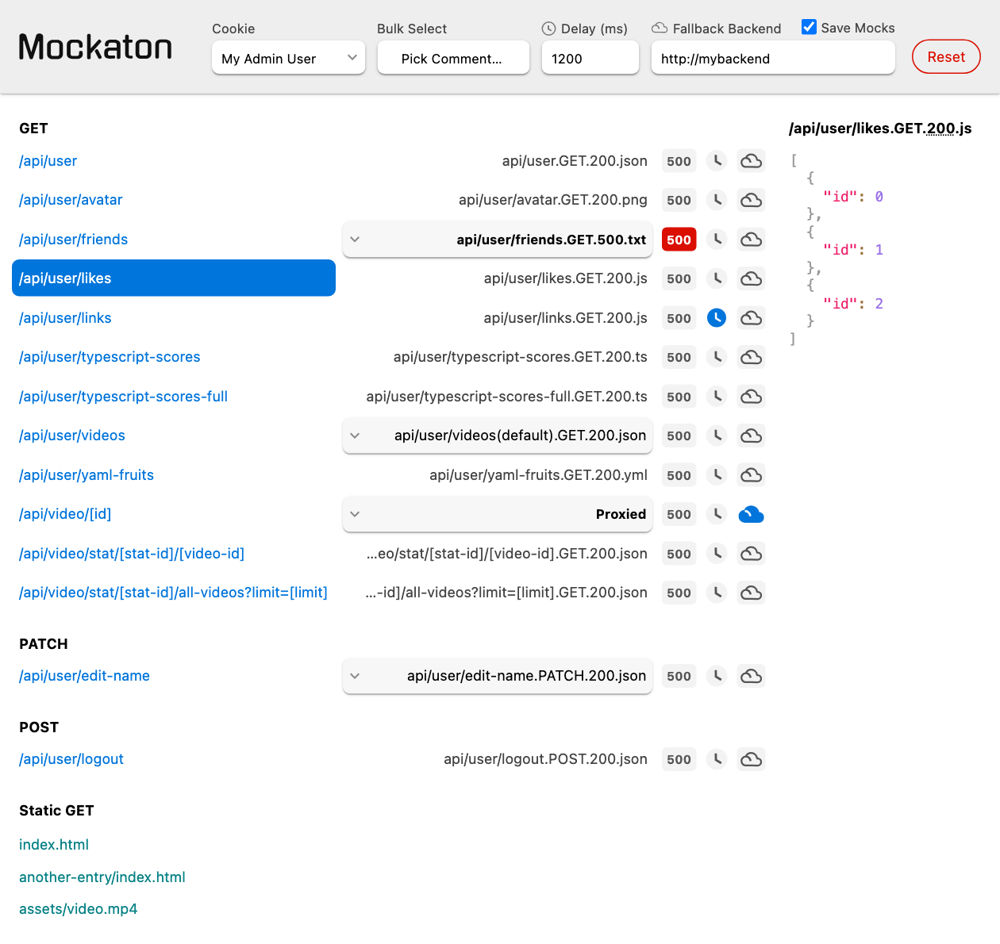
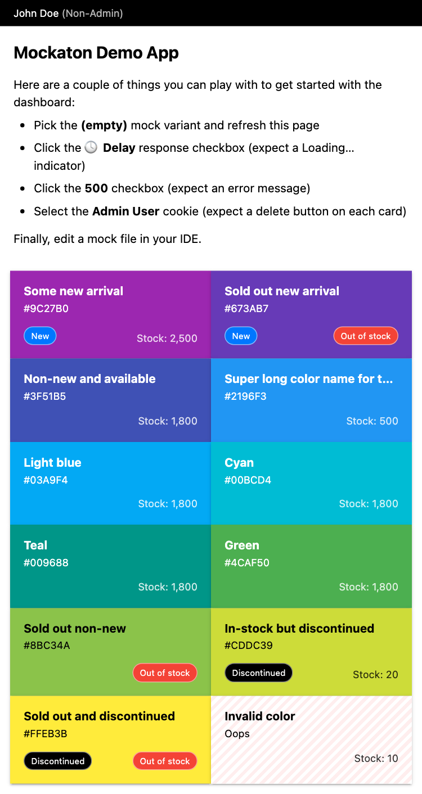

With Mockaton you don’t need to write code for wiring mocks. Instead, it scans a
given directory for filenames following a convention similar to the URLs.

For example, for <code>/<b>api/user</b>/1234</code> the filename would be:
<pre>
<code>my-mocks-dir/<b>api/user</b>/[user-id].GET.200.json</code>
</pre>


On the dashboard you can select a mock variant for a particular route, delaying responses,
and triggering an autogenerated `500` (Internal Server Error), among other features.

Nonetheless, there’s a programmatic API, which is handy
for setting up tests. See **Commander&nbsp;API** section.

<picture>
  <source media="(prefers-color-scheme: light)" srcset="./pixaton-tests/pic-for-readme.vp840x800.light.gold.png">
  <source media="(prefers-color-scheme: dark)" srcset="./pixaton-tests/pic-for-readme.vp840x800.dark.gold.png">
  
</picture>


## Multiple Mock Variants
Each route can have different mocks. There’s two options for doing that:

### Adding comments to the filename
Comments are anything within parentheses,
including them. A filename can have many comments.

<pre>
api/login<b>(locked out user)</b>.POST.423.json
api/login<b>(invalid login attempt)</b>.POST.401.json
</pre>

### Different response status code
For instance, using a `4xx` or `5xx` status code for triggering error
responses. Or a `2xx` such as `204` (No Content) for testing empty collections.

<pre>
api/videos(empty list).GET.<b>204</b>.json
api/videos.GET.<b>403</b>.json
api/videos.GET.<b>500</b>.txt
</pre>


## Fallback to your Backend
No need to mock everything. Mockaton can request from your backend the routes
you don’t have mocks for, or routes that have the ☁️ **Cloud Checkbox** checked.


### Scrapping Mocks from your Backend
If you check **Save Mocks**, Mockaton will collect the responses that hit your backend.
They will be saved on your `config.mocksDir` following the filename convention.


## Basic Usage
Mockaton is a Node.js program with no build or runtime NPM dependencies.

`tsx` is only needed if you want to write mocks in TypeScript.

```sh
npm install mockaton tsx --save-dev
```

Create a `my-mockaton.js` file
```js
import { resolve } from 'node:path'
import { Mockaton } from 'mockaton'

// See the Config section for more options
Mockaton({
  mocksDir: resolve('my-mocks-dir'), // must exist
  port: 2345
})
```

```sh
node --import=tsx my-mockaton.js
```


## Demo App (Vite)

This is a minimal React + Vite + Mockaton app. It’s a list of
colors, which contains all of their possible states. For example,
permutations for out-of-stock, new-arrival, and discontinued.

```sh  
git clone https://github.com/ericfortis/mockaton.git
cd mockaton/demo-app-vite
npm install 

npm run mockaton
npm run start
# BTW, that directory has scripts for running Mockaton and Vite 
# with one command in two terminals.
```


The app looks like this:




## Use Cases
### Testing
- Empty responses
- Spinners by delaying responses
- Errors such as _Bad Request_ and _Internal Server Error_
- Setting up UI tests
- Polled resources (for triggering their different states)
  - alerts
  - notifications
  - slow to build resources
- Mocking third-party APIs

### Time Travel
If you commit the mocks to your repo, it’s straightforward to bisect bugs and
checking out long-lived branches. In other words, you don’t have to downgrade
backends to old API contracts or databases.

### Deterministic Standalone Demo Server
Perhaps you need to demo your app, but the ideal flow is too complex to
simulate from the actual backend. In this case, compile your frontend app and
put its built assets in `config.staticDir`. Then, on the dashboard
**Bulk Select** mocks to simulate the complete states you want to demo.
For bulk-selecting, you just need to add a comment to the mock
filename, such as `(demo-part1)`, `(demo-part2)`.


## Motivation
- Avoids spinning up and maintaining hefty backends when developing UIs.
- For a deterministic, comprehensive, and consistent backend state. For example, having
  a collection with all the possible state variants helps for spotting inadvertent bugs.
- Sometimes frontend progress is blocked waiting for some backend API. Similarly,
  it’s often delayed due to missing data or inconvenient contracts. Therefore,
  many meetings can be saved by prototyping frontend features with mocks, and
  then showing those contracts to the backend team.

## Alternatives
- Chrome DevTools allows for [overriding responses](https://developer.chrome.com/docs/devtools/overrides)
- Reverse Proxies such as [Burp](https://portswigger.net/burp) are also handy for overriding responses.
- [Mock Server Worker](https://mswjs.io)

---

## You can write JSON mocks in JavaScript or TypeScript
For example, `api/foo.GET.200.js`


**Option A:** An Object, Array, or String is sent as JSON.

```js
export default [{ foo: 'bar' }]
```

**Option B:** Function

Return a `string | Buffer | Uint8Array`, but don’t call `response.end()`

```js
export default (request, response) => 
  JSON.stringify({ foo: 'bar' })
```

Think of these functions as HTTP handlers, so you can
intercept requests. For example, for writing to a database.

<details>
<summary><b>See Intercepting Requests Examples</b></summary>

Imagine you have an initial list of colors, and
you want to concatenate newly added colors.

`api/colors.POST.201.js`
```js
import { parseJSON } from 'mockaton'

export default async function insertColor(request, response) {
  const color = await parseJSON(request)
  globalThis.newColorsDatabase ??= []
  globalThis.newColorsDatabase.push(color)

  // These two lines are not needed but you can change their values
  //   response.statusCode = 201 // default derived from filename
  //   response.setHeader('Content-Type', 'application/json') // unconditional default

  return JSON.stringify({ msg: 'CREATED' })
}
```

`api/colors(assorted)(default).GET.200.ts`
```js
import colorsFixture from './colors.json' with { type: 'json' }

export default function listColors() {
  return JSON.stringify([
    ...colorsFixture,
    ...(globalThis.newColorsDatabase || [])
  ])
}
```
</details>

**What if I need to serve a static .js?**
Put it in your `config.staticDir` without the mock filename convention.

---

## Mock Filename Convention

### Extension

The last three dots are reserved for the HTTP Method,
Response Status Code, and File Extension.

```
api/user.GET.200.json
```

You can also use `.empty` or `.unknown` if you don’t
want a `Content-Type` header in the response.

<details>
<summary>Supported Methods</summary>
<p>From <code>require('node:http').METHODS</code></p>
<p>
	ACL, BIND, CHECKOUT,
	CONNECT, COPY, DELETE,
	GET, HEAD, LINK,
	LOCK, M-SEARCH, MERGE,
	MKACTIVITY, MKCALENDAR, MKCOL,
	MOVE, NOTIFY, OPTIONS,
	PATCH, POST, PROPFIND,
	PROPPATCH, PURGE, PUT,
	QUERY, REBIND, REPORT,
	SEARCH, SOURCE, SUBSCRIBE,
	TRACE, UNBIND, UNLINK,
	UNLOCK, UNSUBSCRIBE
</p>
</details>

### Dynamic Parameters
Anything within square brackets is always matched. For example, for this route
`/api/company/1234/user/5678`
<pre>
api/company/<b>[id]</b>/user/<b>[uid]</b>.GET.200.json
</pre>

### Comments
Comments are anything within parentheses, including them.
They are ignored for URL purposes, so they have no effect
on the URL mask. For example, these two are for `/api/foo`
<pre>
api/foo<b>(my comment)</b>.GET.200.json
api/foo.GET.200.json
</pre>

### Default Mock for a Route
You can add the comment: `(default)`. 
Otherwise, the first file in **alphabetical order** wins.

<pre>
api/user<b>(default)</b>.GET.200.json
</pre>


### Query String Params
The query string is ignored when routing to it. In other words, it’s only used for
documenting the URL contract.
<pre>
api/video<b>?limit=[limit]</b>.GET.200.json
</pre>

On Windows filenames containing "?" are [not
permitted](https://learn.microsoft.com/en-us/windows/win32/fileio/naming-a-file), but since that’s part of the query string it’s ignored anyway.


### Index-like routes
If you have `api/foo` and `api/foo/bar`, you have two options:

**Option A:** 
```
api/foo.GET.200.json
api/foo/bar.GET.200.json
```

**Option B:** Omit the filename.
```text
api/foo/.GET.200.json
api/foo/bar.GET.200.json
```

---
## Config
### `mocksDir: string`
This is the only required field. The directory must exist.


### `host?: string`
Defaults to `'localhost'`


### `port?: number`
Defaults to `0`, which means auto-assigned


### `ignore?: RegExp`
Defaults to `/(\.DS_Store|~)$/`


### `delay?: number` 
Defaults to `1200` milliseconds.

Although routes can individually be delayed with the 🕓
checkbox, the delay amount is globally configurable.


### `proxyFallback?: string`
For example, `config.proxyFallback = 'http://example.com'`

Lets you specify a target server for serving routes you don’t have mocks for,
or that you manually picked with the ☁️ **Cloud Checkbox**.

### `collectProxied?: boolean`
Defaults to `false`. With this flag you can save mocks that hit
your proxy fallback to `config.mocksDir`. If there are UUIDv4 in the
URL, the filename will have `[id]` in their place. For example,

```
/api/user/d14e09c8-d970-4b07-be42-b2f4ee22f0a6/likes =>
  my-mocks-dir/api/user/[id]/likes.GET.200.json
```

Your existing mocks won’t be overwritten. That is, the routes you manually
selected for using your backend with the ☁️ **Cloud Checkbox**, will have
a unique filename comment.


<details>
  <summary>Extension Details</summary>
<p>
An <code>.empty</code> extension means the <code>Content-Type</code>
header was not sent by your backend.
</p>

<p>
An <code>.unknown</code> extension means the <code>Content-Type</code> is not in
Mockaton’s predefined list. For that, you can add it to <code>config.extraMimes</code>
</p>
</details>


### `staticDir?: string`
- Use Case 1: If you have a bunch of static assets you don’t want to add `.GET.200.ext`
- Use Case 2: For a standalone demo server. For example,
  build your frontend bundle, and serve it from Mockaton.

Files under `config.staticDir` don’t use the filename convention.
They take precedence over the `GET` mocks in `config.mocksDir`.
For example, if you have two files for `GET /foo/bar.jpg`

<pre>
my-static-dir<b>/foo/bar.jpg</b>
 my-mocks-dir<b>/foo/bar.jpg</b>.GET.200.jpg // Unreacheable
</pre>


### `cookies?: { [label: string]: string }`

```js
import { jwtCookie } from 'mockaton'

config.cookies = {
  'My Admin User': 'my-cookie=1;Path=/;SameSite=strict',
  'My Normal User': 'my-cookie=0;Path=/;SameSite=strict',
  'My JWT': jwtCookie('my-cookie', {
    name: 'John Doe',
    picture: 'https://cdn.auth0.com/avatars/jd.png'
  })
}
```
The selected cookie, which is the first one by default, is sent in every
response in a `Set-Cookie` header. 

If you need to send more cookies, you can either inject them globally
in `config.extraHeaders`, or in function `.js` or `.ts` mock.

By the way, the `jwtCookie` helper has a hardcoded header and signature.
In other words, it’s useful only if you care about its payload.


### `extraHeaders?: string[]`
Note it’s a unidimensional array. The header name goes at even indices.

```js
config.extraHeaders = [
  'Server', 'Mockaton',
  'Set-Cookie', 'foo=FOO;Path=/;SameSite=strict',
  'Set-Cookie', 'bar=BAR;Path=/;SameSite=strict'
]
```


### `extraMimes?: { [fileExt: string]: string }`
```js
config.extraMimes = {
  jpe: 'application/jpeg'
}
```
Those extra media types take precedence over the built-in
[utils/mime.js](src/utils/mime.js), so you can override them.


### `plugins?: [filenameTester: RegExp, plugin: Plugin][]`
```ts
type Plugin = (
  filePath: string,
  request: IncomingMessage,
  response: OutgoingMessage
) => Promise<{
  mime: string,
  body: string | Uint8Array
}>
```
Plugins are for processing mocks before sending them. If no
regex matches the filename, the fallback plugin will read
the file from disk and compute the MIME from the extension.

Note: don’t call `response.end()` on any plugin.

<details>
<summary><b> See Plugin Examples </b></summary>

```shell
npm install yaml
```
```js
import { parse } from 'yaml'
import { readFileSync } from 'node:js'
import { jsToJsonPlugin } from 'mockaton'

config.plugins = [
  
  // Although `jsToJsonPlugin` is set by default, you need to add it to your list if you need it.
  // In other words, your plugins array overwrites the default list. This way you can remove it.
  [/\.(js|ts)$/, jsToJsonPlugin], 
  
  [/\.yml$/, yamlToJsonPlugin],
  [/foo\.GET\.200\.txt$/, capitalizePlugin], // e.g. GET /api/foo would be capitalized
]

function yamlToJsonPlugin(filePath) {
  return {
    mime: 'application/json',
    body: JSON.stringify(parse(readFileSync(filePath, 'utf8')))
  }
}

function capitalizePlugin(filePath) {
  return {
    mime: 'application/text',
    body: readFileSync(filePath, 'utf8').toUpperCase()
  }
}
```
</details>


### `corsAllowed?: boolean`
Defaults to `true`. When `true`, these are the default options:
```js
config.corsOrigins = ['*']
config.corsMethods = require('node:http').METHODS
config.corsHeaders = ['content-type']
config.corsCredentials = true
config.corsMaxAge = 0 // seconds to cache the preflight req
config.corsExposedHeaders = [] // headers you need to access in client-side JS
```


### `onReady?: (dashboardUrl: string) => void`
By default, it will open the dashboard in your default browser on macOS and
Windows. But for a more cross-platform utility, you could `npm install open` and pass it.
```js
import open from 'open'
config.onReady = open
```

If you don’t want to open a browser, pass a noop:
```js
config.onReady = () => {}
```

At any rate, you can trigger any command besides opening a browser.

---

## Commander API
`Commander` is a client for Mockaton’s HTTP API.
All of its methods return their `fetch` response promise.
```js
import { Commander } from 'mockaton'

const myMockatonAddr = 'http://localhost:2345'
const mockaton = new Commander(myMockatonAddr)
```

### Select a mock file for a route
```js
await mockaton.select('api/foo.200.GET.json')
```
### Select all mocks that have a particular comment
```js
await mockaton.bulkSelectByComment('(demo-a)')
```
Parentheses are optional, so you can pass a partial match.
For example, passing `'demo-'` (without the final `a`), selects the
first mock in alphabetical order that matches.

### Set Route is Delayed Flag
```js
await mockaton.setRouteIsDelayed('GET', '/api/foo', true)
```

### Set Route is Proxied
```js
await mockaton.setRouteIsProxied('GET', '/api/foo', true)
```

### Select a cookie
In `config.cookies`, each key is the label used for selecting it.
```js
await mockaton.selectCookie('My Normal User')
```

### Set Fallback Proxy
```js
await mockaton.setProxyFallback('http://example.com')
```
Pass an empty string to disable it.

### Set Save Proxied Mocks
```js
await mockaton.setCollectProxied(true)
```

### Reset
Re-initialize the collection. The selected mocks, cookies, and delays go back to
default, but the `proxyFallback`, `colledProxied`, and `corsAllowed` are not affected.
```js
await mockaton.reset()
```

<div style="display: flex; align-items: center; gap: 20px">
  
</div>
