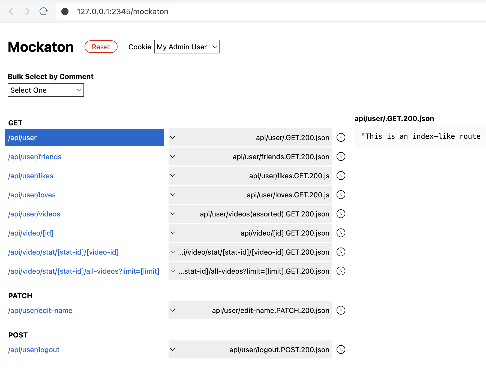
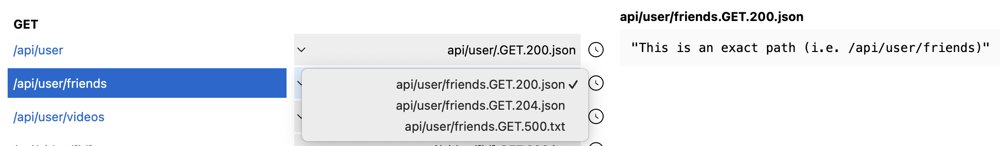
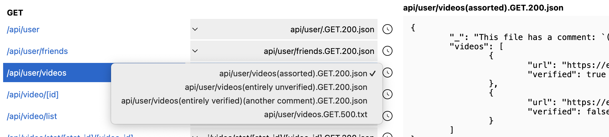

# Mockaton (Mock Server)

Mockaton scans `Config.mocksDir` for files
following a specific file name convention, which is similar to the URLs.

For example, the following file will be served for `/api/user/1234`
```
api/
api/user/
api/user/[user-id].GET.200.json
```

By the way, this [browser
extension](https://github.com/ericfortis/devtools-ext-tar-http-requests) can
be used for downloading a tar of your XHR requests following that convention.


### Mock Variants
Each route can have different mocks and those variants could either be:
- a different response status code, (e.g. 200, 401), or
- a comment on the filename, which is anything within parentheses.

Those variants can be manually selected in the dashboard
UI, or programmatically, for instance, for setting up tests.


## Getting Started
The best way to learn _Mockaton_ is by checking out this repo and
exploring its [sample-mocks/](./sample-mocks) directory. Then run
[`./_usage_example.js`](./_usage_example.js) and you’ll see this dashboard:




### Mock Variants of Status Code
The **sample-mocks/** directory has three mock alternatives for serving
`/api/user/friends`:
- an HTTP status of _200 - OK_,
- another one with _204 - No Content_ of an empty list of friends, and
- a _501 - Internal Server Error_
	- 501 mocks get autogenerated for routes that have no 501’s.



### Mock Variants with Comments
Comments are anything within parentheses, including them.


---

## Delay
The clock icon next to the mock selector dropdown is a checkbox for delaying a
particular response. They are handy for testing spinners when developing UIs. 

The milliseconds for the delay is globally configurable via `Config.delay = 1200`

---

## Basic Usage (see [_usage_example.js](./_usage_example.js))
```
npm install mockaton
```
Create a `my-mockaton.js` file
```js
import { resolve } from 'node:path'
import { Mockaton } from 'mockaton'

Mockaton({ // Config options
  port: 2345,
  mocksDir: resolve('my-mocks-dir')
})
```

```sh
node my-mockaton.js
```

## Config Options
```ts
interface Config {
  mocksDir: string
  staticDir?: string
  host?: string,
  port?: number

  cookies?(): object

  skipOpen?: boolean
  allowedExt?: RegExp
  delayMilliseconds?: number
  database?: object
}
```

## Cookies
```js
import { jwtCookie } from 'mockaton'

Config.cookies = {
  'My Admin User':  'my-cookie=1;Path=/;SameSite=strict',
  'My Normal User': 'my-cookie=0;Path=/;SameSite=strict',
  'My JWT': jwtCookie('my-cookie', { foo: 'bar' })
}
```

That `jwtCookie` has a hardcoded header and signature. In other
words, it’s useful iff you care about its payload in frontend.

---

## File Name Convention


### Extension
`.Method.HttpResponseStatusCode.FileExt`

The **file extension** can anything, but `.md` and `.mjs` are reserved
for documentation, and mock processors (more on that later).

The `Config.allowedExt` regex defaults to: `/\.(json|txt|md|mjs)$/`


### Dynamic Parameters
Anything within square brackets. For example, `api/user/[id]/[age].GET.200.json`

### Comments
Comments are anything within parentheses, including them, and they are
ignored for URL purposes. In other words, comments have no effect on the
URL mask. For example, these two are for `/api/foo`
```
api/foo(my comment).GET.200.json(foo)
api/foo.GET.200.json
```

### Query String Params
```
api/video?limit=[limit].GET.200.json
```
The query string behaves like comments in the sense it’s
only used for documenting the URL API contract.

In other words, the query string is ignored when routing to it. BTW, in Windows,
filenames containing "?" are not permitted, but they are ignored anyway.

https://learn.microsoft.com/en-us/windows/win32/fileio/naming-a-file


### Default (index-like) file
For the default route of a directory, omit the name (just use
the extension). For example, the following files will be routed
to `api/foo` because comments and the query string are ignored.
```text
api/foo/.GET.200.json
api/foo/?bar=[bar].GET.200.json
api/foo/(my comment).GET.200.json
```

---


---
## Mock Precedence
The first file in **alphabetical order** wins when a particular route has many files.

### Why do we have many mocks per Route+Method?
Each route has mocks for many status codes, and also different
mocks (by having comments) for testing particular scenarios.
For example, different 422 validation error messages.

---

## Reset the Dashboard UI after insert or delete
When deleting the currently selected option, without refreshing the dashboard, the
served mock will be an alternative mock if it exists. That is, the dashboard won't show
a 404 after deleting the current mock if there’s another mock for that particular route.

Similarly, inserting a file that goes first in alphabetical order will
send a different mock from the one stated in the dashboard dropdown.

---

## Documenting Contracts (.md)
This is handy for documenting request payload parameters. The dashboard will
print the markdown document (as plain text) above the actual payload content.

Create a markdown file following the same filename convention.
The status code can be any number. For example,
```text
api/foo/[user-id].POST.201.md
```

---

## Non-Deterministic Mocks (.mjs handlers)
Using the same filename convention, files ending
with `.mjs` will process the mock before serving it.

For example, this handler will uppercase the mock body.
```js
export default capitalizeAllText(mockAsText, requestBody) {
  return mockAsText.toUpperCase();
}
```

In demo mode, transforms tagged with the string `demo` within a filename
comment get activated. Mock sets tags e.g. `demo-a` have no effect. In
other words, only one transform per route is supported in demo mode.

---

## Bulk Selecting Mocks by Matching comments
Many mocks can be changed at once. We do that by searching the
comments on the filename. For example, `api/foo(demo-a).GET.200.json`

Non-matching mocks are ignored. For instance, if for a
particular API there is only `demo-a` and `demo-b`, changing to
`demo-c` will preserve the last one that was successfully set.

Similarly, if there’s no demo mock at all for
a route, the first dev mock (a-z) will be served.


