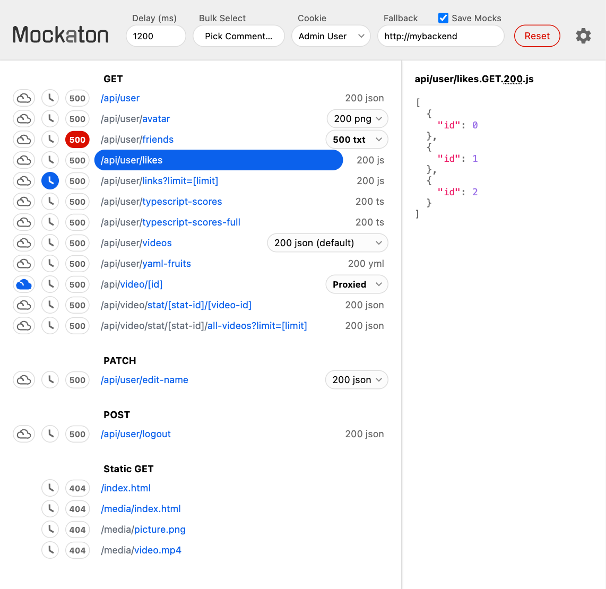

[](https://github.com/ericfortis/mockaton/actions/workflows/test.yml)
[](https://codecov.io/github/ericfortis/mockaton)

An HTTP mock server for simulating APIs with minimal setup &mdash; ideal
for testing difficult to reproduce backend states. 

https://mockaton.com

## Overview
With Mockaton, you don’t need to write code for wiring up your
mocks. Instead, a given directory is scanned for filenames
following a convention similar to the URLs.

For example, for [/api/company/123](#), the filename could be:

<pre>
<code>my-mocks-dir/<b>api/company</b>/[id].GET.200.json</code>
</pre>

<br/>


## Quick Start (Docker)
This will spin up Mockaton with the sample directories
included in this repo mounted on the container.

_[mockaton-mocks/](./mockaton-mocks) and [mockaton-static-mocks/](./mockaton-static-mocks)_

```sh
git clone https://github.com/ericfortis/mockaton.git --depth 1
cd mockaton
make docker
```
Dashboard: http://localhost:2020/mockaton


Test it:
```shell
curl localhost:2020/api/user
```


<br/>

## Dashboard


<picture>
  <source media="(prefers-color-scheme: light)" srcset="pixaton-tests/tests/macos/pic-for-readme.vp761x740.light.gold.png">
  <source media="(prefers-color-scheme: dark)" srcset="pixaton-tests/tests/macos/pic-for-readme.vp761x740.dark.gold.png">
  
</picture>

On the dashboard you can:
- Select a mock variant for a particular route
- 🕓 Delay responses
- Trigger an autogenerated `500` error
  - …and cycle it off (for testing retries)

Nonetheless, there’s a programmatic API, which is handy for
setting up tests (see **Commander&nbsp;API** section below).


## License
MIT
