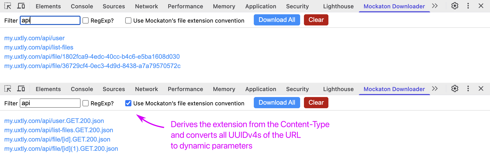
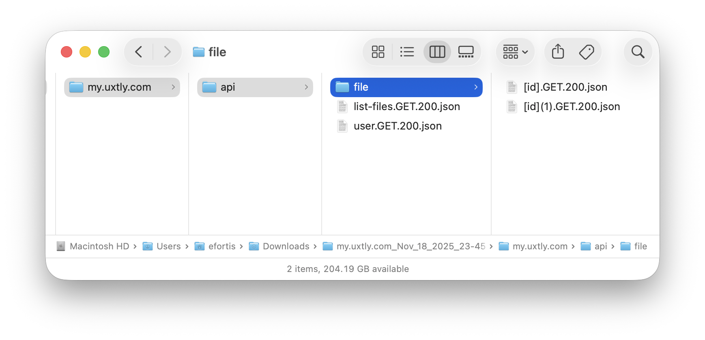

# Mockaton Downloader

Browser extension for downloading HTTP request responses.

## Install
https://chromewebstore.google.com/detail/babjpljmacbefcmlomjedmgmkecnmlaa


## Overview
This extension lets you save to disk API calls, images, and static
assets in general.

**Download All** saves them to your disk. There’s an option for
using a file extension Mockaton understands, so you can serve them
without wiring them up.

<br/>



<br/>

They get saved to disk like this:



## Caveats

### Cached resources (304s) are ignored
But you can check [x] **Disable cache** in the Network panel.

### Videos are ignored
Partial content (206s) responses are unsupported.

### .dot-files
We add a `_DOT_` prefix to dot-files. Otherwise, Chrome
doesn’t save them. For example,

```txt
     example.com/.foo/bar
example.com/_DOT_.foo/bar // renamed
```

