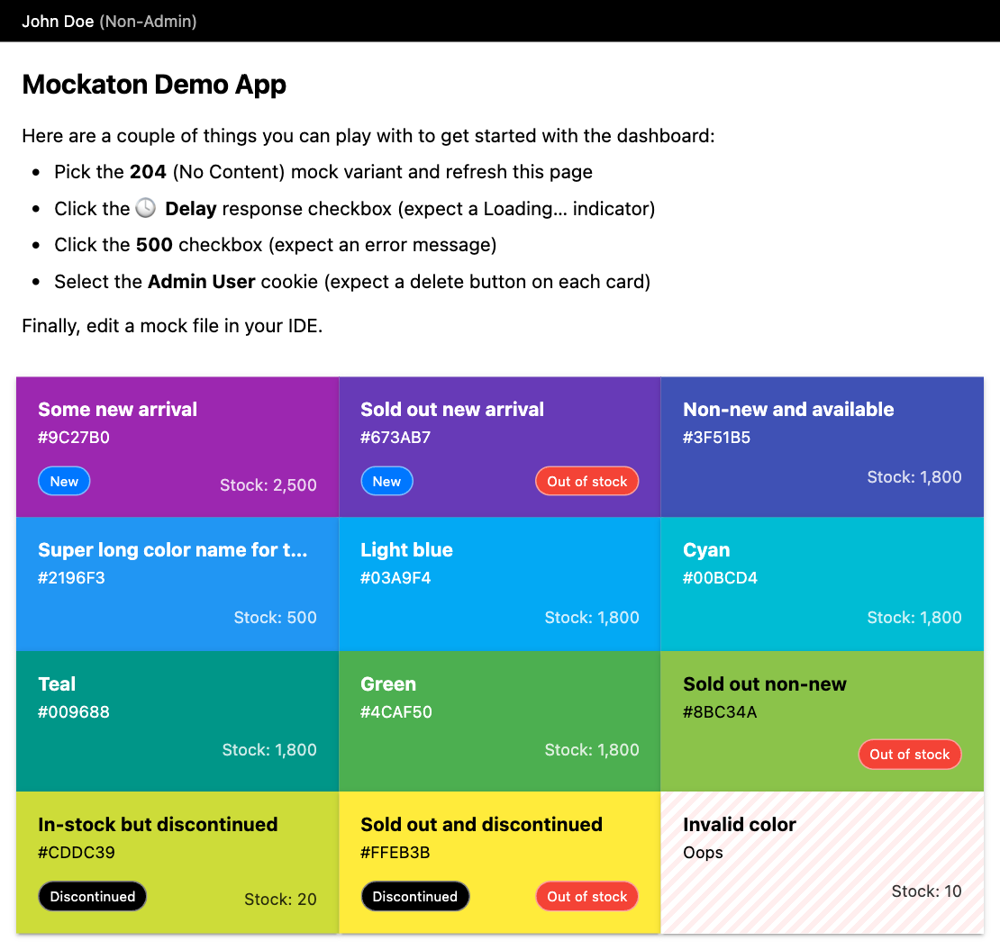

# Mockaton Colors App Demo

This a minimal React + Vite + Mockaton app you can play with.




## Dev Setup
### Install Dependencies
```
cd demo-app-vite
npm install
```


### Start Mockaton and Vite
On another terminal:
```sh
npm run start  
```


### vite.config.js

For proxying Mockaton we pass its address as an environment variable:

```js 
server: {
  proxy: {
    '/api': {
      target: process.env.BACKEND,
      changeOrigin: true
    }
}
```

---

## Standalone Demo Server
This will build the frontend SPA, and start a docker container
with Mockaton serving that SPA.

```sh
cd demo-app-vite
make
```

- App: http://127.0.0.1:4040/mockaton
- Dashboard: http://127.0.0.1:4040/mockaton
