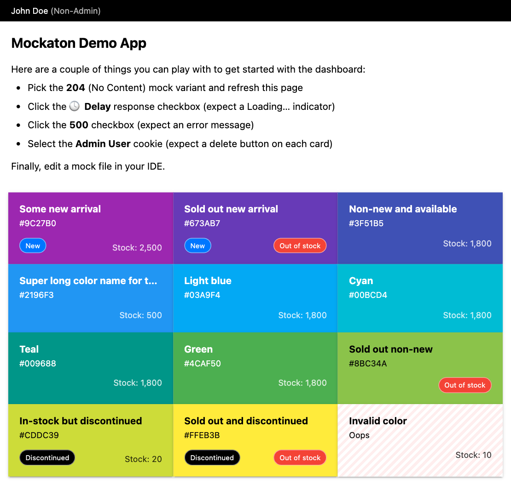

# Mockaton Colors App Demo

This a minimal React + Vite + Mockaton app you can play with.




## Dev Setup
```sh
cd demo-app-vite
npm install
npm start ;# Starts Mockaton and Vite
```

---

## Standalone Demo Server
This will build the frontend SPA, and start a docker container
with Mockaton serving that SPA.

```sh
cd demo-app-vite
make
```

- App: http://127.0.0.1:4040/mockaton
- Dashboard: http://127.0.0.1:4040/mockaton
